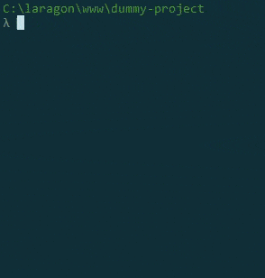

# Seeds for Laravel by Laracademy

  [](https://packagist.org/packages/laracademy/seeds) [](https://packagist.org/packages/laracademy/seeds) [](https://packagist.org/packages/laracademy/seeds)

This package adds a new `artisan` command which offers a better way to seed your database: You can select the seeder from a selection and during running you will get feedback on what is being done.

## Getting Started

The easiest way to get started is to install the package using `composer`. You can do so by running the following command.

```bash
composer require laracademy/seeds
```

That's it! Well, as long as you are using `Laravel 5.5 or higher`. If you are using an older version of Laravel please see below.

## Usage

To use the package you just need to run the `artisan` command and follow the prompts on the screen.

```bash
php artisan seeds
```

### Preview


### Laravel 5.4 and lower

You will need to add the package into your service provider array found in `config/app.php`.

```php
providers = [
    // listing of providers
    Laracademy\Commands\SeedsServiceProvider::class,
    // rest of providers
];
```
